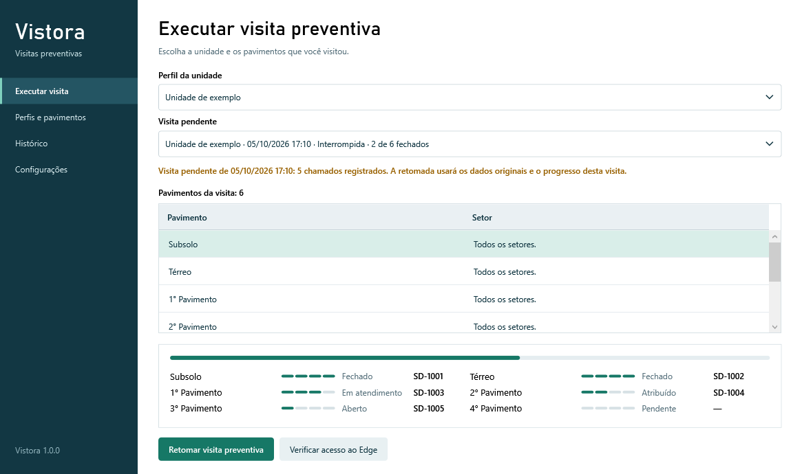
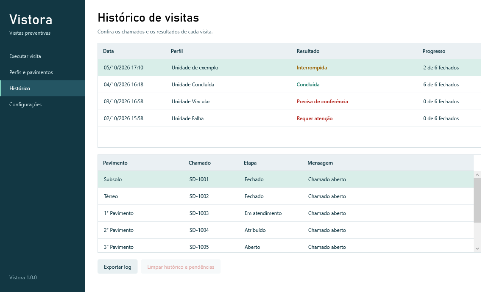

<h1 align="center">Vistora</h1>

<p align="center">
  Automação de chamados de visitas preventivas no Jira, com execução pelo Microsoft Edge.
</p>

<p align="center">
  <strong>Versão 1.0.0</strong> · Windows x64
</p>

<p align="center">
  
  
</p>

<p align="center">
  <sub>Capturas da aplicação com dados fictícios.</sub>
</p>

---

## Sobre o projeto

Vistora é uma aplicação desktop desenvolvida em .NET 10 e WPF para registrar visitas preventivas por unidade e pavimento. O operador cadastra os dados do solicitante e os textos da visita, escolhe os pavimentos e acompanha o processamento dos chamados na tela.

A automação usa a interface do Jira em uma janela visível do Microsoft Edge. Para cada pavimento selecionado, abre um chamado, atribui ao técnico conectado, inicia o atendimento e envia o fechamento. A resolução cadastrada também é utilizada no comentário público. O progresso é salvo localmente para permitir a retomada de visitas interrompidas.

---

## Funcionalidades

| Funcionalidade | Descrição |
|---|---|
| Perfis de unidades | Cadastra solicitante, unidade, dados do formulário e anexos opcionais. |
| Pavimentos e resoluções | Permite adicionar, remover e ordenar pavimentos, com setor, sala e texto próprios. |
| Seleção da visita | Processa apenas os pavimentos marcados pelo operador. |
| Automação no Edge | Preenche os formulários e executa as transições pela interface do Jira, sem integração com sua API. |
| Acompanhamento | Mostra o número do chamado e as etapas de cada pavimento durante a execução. |
| Retomada de pendências | Recupera os dados originais da visita e confere os chamados antes de continuar. |
| Conferência de resultados | Verifica responsável e atendimento; no fechamento, confere status, resolução, comentário público e equipe. |
| Histórico de visitas | Reúne resultados, progresso e detalhes dos chamados. |
| Exportação de diagnóstico | Gera um ZIP com registros da visita e de suas retomadas para análise. |
| Limpeza do histórico | Remove visitas e seus diagnósticos locais após confirmação do operador. |

---

## Stack

- **.NET 10**: execução das bibliotecas e do aplicativo Windows.
- **WPF**: janelas, formulários, navegação e acompanhamento das visitas.
- **Playwright para .NET**: identificação dos controles e automação do Jira no Microsoft Edge.
- **System.Text.Json**: armazenamento de perfis, configurações e progresso das visitas.
- **PowerShell**: preparação do SDK, compilação, testes e publicação.
- **Projetos de teste em C#**: verificações de regras, persistência, interface e navegador com páginas locais controladas.

---

## Estrutura do projeto

```text
Vistora/
├── assets/
│   ├── screenshots/                     # Capturas com dados fictícios
│   └── resolucoes.txt                   # Textos genéricos para novos perfis
├── guides/
│   ├── USO.md                           # Configuração, execução e retomada
│   └── MANUTENCAO.md                    # Automação, testes e diagnóstico
├── scripts/
│   ├── Bootstrap.ps1                    # Instala o SDK na pasta do projeto
│   ├── Build.ps1                        # Compila a solução em Release
│   ├── Test.ps1                         # Executa as verificações automatizadas
│   └── Publish.ps1                      # Gera a aplicação e o ZIP de distribuição
├── src/
│   ├── Vistora.Core/                    # Modelos, validação e execução de visitas
│   ├── Vistora.Infrastructure/          # Persistência, logs e exportação
│   ├── Vistora.Automation.Edge/         # Formulários e transições no Jira
│   └── Vistora.Desktop/                 # Interface WPF e recursos da marca
├── tests/
│   ├── Vistora.Tests/                   # Regras, persistência e diagnóstico
│   ├── Vistora.DesktopTests/            # Controles e comportamento da interface
│   └── Vistora.BrowserTests/            # Automação real do Edge em ambiente local
├── LICENSE                              # Licença MIT
├── Vistora.sln                          # Solução .NET
└── README.md                            # Apresentação do projeto
```

---

## Arquitetura

A solução está dividida em quatro projetos:

1. **Vistora.Core**: define perfis, pavimentos e estados da visita. Valida as entradas, seleciona pendências e coordena abertura, atribuição, atendimento e fechamento.
2. **Vistora.Infrastructure**: salva os dados em JSON, mantém cópias anteriores dos arquivos e registra os diagnósticos. Também reúne a exportação e a limpeza de dados das visitas.
3. **Vistora.Automation.Edge**: implementa as operações no navegador. Identifica campos, preenche formulários, executa transições e lê os resultados no Jira.
4. **Vistora.Desktop**: apresenta as telas de execução, perfis, histórico e configuração, conectando as ações do operador às demais camadas.

O motor registra a intenção de uma ação antes de enviá-la ao Jira e salva o resultado depois da conferência. Quando um envio fica sem confirmação, a visita conserva essa pendência para que o operador confira o chamado na retomada.

---

## Configuração local e retomada

Em **Configurações**, informe o endereço do Jira, o formulário de visita preventiva e a fila de atendimento. Os três endereços devem usar HTTPS e pertencer ao mesmo servidor. Os valores iniciais são exemplos e precisam ser substituídos pelos do ambiente de uso.

Em **Perfis e pavimentos**, cadastre o solicitante e a unidade. Ajuste os pavimentos e suas resoluções para o trabalho realizado. Os anexos do perfil, quando informados, são enviados em cada chamado.

O login é feito na janela do Edge. A conta conectada identifica o técnico; o solicitante é definido pelo perfil da unidade. Perfis, configurações, visitas e sessão do navegador ficam em `%LOCALAPPDATA%\Vistora`. A equipe de fechamento é configurada em `ClosingTeam`, no arquivo local `settings.json`.

### Retomar uma visita

A tela **Executar visita** reúne as visitas pendentes, inclusive as de perfis excluídos. Se houver várias opções, escolha a visita no campo **Visita pendente**. A retomada usa as configurações e os textos salvos na criação da visita.

Se uma abertura foi enviada sem o número do chamado, informe o chamado existente quando solicitado. O aplicativo confere seus dados antes de vinculá-lo. Um fechamento sem confirmação pode exigir conferência na janela do Edge: autorize outra tentativa somente se a resolução e o comentário público ainda não tiverem sido enviados. Os procedimentos estão no [guia de uso](guides/USO.md).

---

## Como compilar e executar

### Pré-requisitos

- Windows x64 com Microsoft Edge instalado.
- SDK .NET 10 para compilar e testar, instalado no computador ou preparado pelo script abaixo.
- Acesso ao Jira e permissões para abrir, atribuir, iniciar e fechar os chamados do fluxo configurado.
- PowerShell, com os comandos executados a partir da raiz do repositório.

### Passo a passo

1. Clone o repositório:

   ```powershell
   git clone https://github.com/brendonpereiradev/Vistora.git
   cd Vistora
   ```

2. Se precisar do SDK, instale-o apenas na pasta do projeto:

   ```powershell
   .\scripts\Bootstrap.ps1
   ```

3. Compile a solução:

   ```powershell
   .\scripts\Build.ps1
   ```

4. Inicie o aplicativo usando o SDK encontrado pelos scripts:

   ```powershell
   . .\scripts\Common.ps1
   & (Get-VistoraDotnet) run --project .\src\Vistora.Desktop -c Release --no-build
   ```

### Comandos disponíveis

| Comando | Descrição |
|---|---|
| `.\scripts\Bootstrap.ps1` | Instala o SDK localmente em `.tools/dotnet`. |
| `.\scripts\Build.ps1` | Compila todos os projetos em Release. |
| `.\scripts\Test.ps1` | Executa os testes de regras, persistência, interface e navegador. |
| `.\scripts\Test.ps1 -SkipBrowser` | Executa os testes de regras, persistência e interface sem abrir o Edge. |
| `.\scripts\Publish.ps1` | Gera a aplicação com runtime incluído e o ZIP da versão. |
| `.\scripts\Publish.ps1 -OutputDirectory .\output\minha-publicacao` | Publica em uma pasta alternativa. |

Os testes do navegador usam páginas locais controladas. Os projetos de teste são executáveis acionados pelo script `Test.ps1`.

A publicação da versão 1.0.0 gera `output/release/1.0.0/Vistora/` e `Vistora-1.0.0-Windows-x64.zip` na mesma pasta de versão. Extraia o ZIP inteiro e abra `Vistora.exe`. O runtime .NET acompanha o pacote; o Microsoft Edge precisa estar instalado. Mantenha os arquivos e a pasta `.playwright` junto ao executável. Para repetir uma publicação, escolha uma pasta de saída nova.

---

## Fluxo de uso

1. **Configure o ambiente:** salve os endereços do Jira, do formulário e da fila em Configurações.
2. **Prepare o perfil:** preencha os dados em Perfis e pavimentos e revise a resolução de cada pavimento.
3. **Confira o acesso:** em Executar visita, clique em Verificar acesso ao Edge e faça login quando solicitado.
4. **Execute a visita:** escolha o perfil, marque os pavimentos e clique em Executar visita preventiva. Se houver uma pendência selecionada, o botão permite retomar essa visita.
5. **Acompanhe o resultado:** consulte as etapas e os chamados na execução e no Histórico. Use Parar execução para interromper o fluxo; uma ação já enviada aguarda seu resultado antes da parada.

---

## Logs e diagnóstico

No **Histórico**, selecione uma visita e clique em **Exportar log**. Informe um rótulo opcional, escolha se deseja incluir capturas de falha e salve o ZIP fora da pasta de dados do Vistora. Sem uma visita selecionada, a exportação permite escolher uma abertura do aplicativo.

O pacote reúne resumos, eventos, informações do ambiente e um manifesto com checksums. Perfis e configurações completos, anexos e sessão do navegador ficam fora da exportação. Números dos chamados e identificadores técnicos são mantidos para investigação. Capturas são opcionais e podem conter dados visíveis do chamado.

Os registros ficam em `logs/` e `diagnostics/` dentro de `%LOCALAPPDATA%\Vistora`. A configuração padrão utiliza rotação de 10 MB, retenção de 30 dias e orçamento de 200 MB, preservando os diagnósticos de visitas pendentes. Consulte o [guia de manutenção](guides/MANUTENCAO.md) para detalhes.

---

## Documentação

- [Guia de uso](guides/USO.md): configuração de unidades, execução, retomada e limpeza do histórico.
- [Guia de manutenção](guides/MANUTENCAO.md): configuração técnica, testes e investigação de falhas.
- [Modelos de resolução](assets/resolucoes.txt): textos genéricos que podem ser ajustados em cada perfil.

---

## Licença e termos

Distribuído sob a licença MIT. Consulte o arquivo [LICENSE](LICENSE).

As dependências de terceiros mantêm suas próprias licenças. O acesso ao Jira depende das permissões da conta e da configuração do ambiente utilizado.
